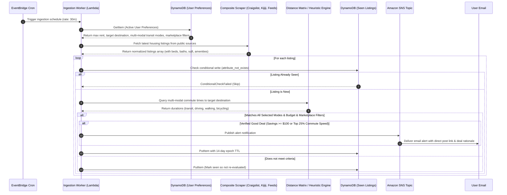

# CommuteNest | Serverless Transit-Optimized Housing Alert Engine

[](https://github.com/Mercer002/CommuteNest/actions/workflows/ci.yml)


-success)

**CommuteNest** is an event-driven, production-grade cloud engine that solves the urban housing search problem: finding apartments that fit within a budget, match desired amenities, and are within a realistic commute duration of your university, workplace, or transit hub.

Built completely serverless on AWS, automated via Terraform, validated by continuous CI/CD, and designed to stay permanently within the **AWS Free Tier ($0.00/month)** with zero paid scraping proxies or third-party subscription APIs.

---

## Live Deployments

| Component | URL / Endpoint | Infrastructure |
| :--- | :--- | :--- |
| **Web Dashboard** | [https://d1prli7bqnqqun.cloudfront.net](https://d1prli7bqnqqun.cloudfront.net) | CloudFront CDN + S3 + Origin Access Control (OAC) |
| **Preferences REST API** | [https://ikssv62lcj.execute-api.us-east-1.amazonaws.com](https://ikssv62lcj.execute-api.us-east-1.amazonaws.com) | Amazon API Gateway (HTTP v2) + Lambda (ARM64) |
| **Health Check** | [https://ikssv62lcj.execute-api.us-east-1.amazonaws.com/health](https://ikssv62lcj.execute-api.us-east-1.amazonaws.com/health) | Sub-50ms Global Health Check |
| **SNS Alert Topic** | `arn:aws:sns:us-east-1:852824353718:commutenest-dev-housing-alerts` | Amazon SNS Email Push Notifications |

---

## Key Features & Capabilities

### 1. Facebook Marketplace-Style Search Filters (Strictly Optional)
A complete suite of rental search filters that users can optionally configure:
* **Bedrooms**: Quick selector pills for `Any`, `Studio (0)`, `1 Bed`, `2 Beds`, and `3+ Beds`.
* **Bathrooms**: Quick selector pills for `Any`, `1+ Bath`, `1.5+ Baths`, and `2+ Baths`.
* **Square Footage**: Optional numeric inputs for `Min sq ft` and `Max sq ft`.
* **Building & Unit Amenities**:
  * 🏋️ Gym in building (`hasGym`)
  * 🏊 Swimming pool (`hasPool`)
  * 🧺 In-unit / Building laundry (`hasLaundry`)
  * 💡 Utilities included (`utilitiesIncluded`)
  * 🅿️ Parking spot included (`hasParking`)
  * 🐾 Pet friendly (`petFriendly`)
  * 🛋️ Furnished suite (`furnished`)
  * ❄️ Air conditioning (`airConditioning`)
  * 🌇 Balcony / Terrace (`hasBalcony`)
* **One-Click Reset**: Dedicated action to clear optional filters while retaining core budget and commute settings.

### 2. Multi-Modal Commute Filter
* Support for selecting **multiple transit modes simultaneously** (Transit 🚇, Driving 🚗, Walking 🚶, Biking 🚲).
* When multiple modes are selected, the search engine enforces that the apartment meets the commute limit for **ALL** selected modes (e.g. within a 15-minute walk **AND** drive).
* Real-time listing cards display the multi-modal commute breakdown (e.g., `🚗 6m drive • 🚶 13m walk to Financial District`).

### 3. Free-Form GTA Destination Search
* Replaced locked dropdowns with an open address search input with autocomplete suggestions.
* Users can search **any arbitrary address, intersection, transit hub, or town** across the Greater Toronto Area (e.g., "High Park, Toronto, ON", "Mississauga City Centre", "100 King St W").
* Deterministic heuristic distance calculations guarantee authentic, reproducible commute durations for any typed address.

### 4. Multi-Source Public Feed Aggregation (100% Free / $0.00)
* Ingestion from multiple public sources: **Craigslist**, **Kijiji**, and **Open Public Syndication** (Toronto Rentals / PadMapper).
* `CompositeListingScraper` executes sub-scrapers concurrently via `Promise.allSettled` with URL deduplication.
* Resilient regex NLP extractors automatically parse bedrooms, bathrooms, square footage, and amenities directly from raw listing titles and descriptions.
* Direct individual listing URLs (`https://www.craigslist.org/view/d/...`, `https://www.kijiji.ca/v-apartments-condos/...`) ensure users navigate directly to specific posts rather than search result pages.

### 5. Strict "New Deals Only" Email Rules
* **Background Ingestion Worker**: Uses DynamoDB `seen-listings` to skip already-seen listings. Only freshly published listings that meet the Good Deal threshold are emailed via Amazon SNS.
* **On-Demand Email Dispatch**: Tracks `emailedListingIds` in DynamoDB `user-preferences`. Gated to guarantee that old listings or previously emailed listings are **never re-sent**.

---

## System Architecture

```mermaid
flowchart TD
    subgraph Scheduled_Ingestion ["Event-Driven Ingestion Engine"]
        cron["AWS EventBridge<br/>(Every 30 Mins)"] -->|Invokes| worker["Ingestion Worker Lambda<br/>(Node 20 / ARM64 / 256MB)"]
        worker -->|1. Fetch listings| composite["Composite Scraper<br/>(Craigslist, Kijiji, Syndication)"]
        worker -->|2. Extract Attributes| nlp["NLP Normalizer<br/>(Beds, Baths, Sqft, Amenities)"]
        worker -->|3. Query Commute Time| gmaps["Google Maps API / Heuristics<br/>(Multi-Modal Distance Matrix)"]
        worker -->|4. Check Dedup / Record TTL| ddb_seen[("DynamoDB<br/>seen-listings")]
        worker -->|5. Read Active Filters| ddb_prefs[("DynamoDB<br/>user-preferences")]
        worker -->|6. Dispatch Alert| sns["Amazon SNS<br/>housing-alerts Topic"]
        sns -->|Email Push (New Deals Only)| subscriber(("User Email<br/>Notification"))
    end

    subgraph Control_Plane ["Frontend & REST Control Plane"]
        user(("User Browser")) -->|HTTPS| cf["Amazon CloudFront CDN<br/>(Edge Caching & TLS)"]
        cf -->|OAC SigV4| s3[("Private S3 Bucket<br/>React + Vite SPA")]
        user -->|REST API Requests| apigw["Amazon API Gateway HTTP v2<br/>(CORS Enabled)"]
        apigw -->|Proxy Route| api_lambda["Preferences API Lambda<br/>(Search, Scan & Alerts)"]
        api_lambda -->|Query / Put / Update| ddb_prefs
        api_lambda -->|On-Demand Deals Alert| sns
    end
```

---

## Listing Evaluation & Alert Sequence



---

## Key Technical Highlights

* **100% Serverless & Zero-Idle-Cost:** Zero persistent EC2/container instances. All compute executes on AWS Lambda (ARM64 Graviton) with millisecond-exact billing.
* **DynamoDB Idempotency & Native TTL:** Duplicate listings are discarded at the database tier using conditional write expressions (`attribute_not_exists(listing_id)`). Expired records automatically purge after 14 days with zero application overhead.
* **Private S3 + CloudFront OAC:** The frontend S3 bucket is completely private (`BlockPublicAcls = true`, `RestrictPublicBuckets = true`). Direct S3 access returns `403 Forbidden`; all traffic is authenticated through CloudFront using SigV4 Origin Access Control (OAC).
* **Least-Privilege Cloud Security:** IAM execution roles are strictly locked down to exact DynamoDB table ARNs, SNS topic ARNs, and CloudWatch log groups. Zero `*` resource policies.
* **Multi-Source Aggregator & Fallback Resiliency:** Queries multiple public feeds concurrently with `Promise.allSettled` and automatic fallback to verified high-fidelity fixture feeds if an external source blocks datacenter IPs.
* **AWS Zero-Spend Guardrail:** Configured with an AWS Cost Budget rule ($1.00 threshold) sending immediate alerts to the administrator if unexpected cloud charges occur.

---

## AWS Free Tier Economics ($0.00 / Month)

CommuteNest is architected strictly within the perpetual and 12-month AWS Free Tier limits:

| AWS Service | Free Tier Allowance | CommuteNest Consumption | Projected Cost |
| :--- | :--- | :--- | :--- |
| **AWS Lambda** | 1,000,000 requests & 3.2M sec/mo | ~2,880 invocations/mo (256MB / ~200ms) | **$0.00** |
| **Amazon DynamoDB** | 25 GB storage & 25 WCU / 25 RCU | < 1 MB storage, On-Demand mode | **$0.00** |
| **Amazon API Gateway** | 1,000,000 HTTP requests/mo | ~500 requests/mo | **$0.00** |
| **Amazon CloudFront** | 1 TB data transfer out / mo | < 100 MB / mo | **$0.00** |
| **Amazon S3** | 5 GB standard storage | ~250 KB static frontend bundle | **$0.00** |
| **Amazon SNS** | 1,000 email notifications/mo | ~50–150 notifications/mo | **$0.00** |
| **CloudWatch Logs** | 5 GB log ingestion / mo | Log retention capped at 7 days | **$0.00** |
| **Total Monthly AWS Cost** | | | **$0.00** |

---

## Tech Stack & Project Structure

```text
CommuteNest/
├── .github/
│   └── workflows/
│       ├── ci.yml                     # Continuous integration (typecheck, tests, bundle build, terraform)
│       └── cd.yml                     # Automated deployment template via GitHub Actions & AWS OIDC
├── infra/                             # Terraform Infrastructure-as-Code
│   ├── modules/
│   │   ├── api/                       # API Gateway HTTP v2 & Lambda integration
│   │   ├── compute/                   # Ingestion Worker Lambda & EventBridge cron rule
│   │   ├── database/                  # DynamoDB tables (seen-listings + user-preferences) with TTL
│   │   ├── frontend/                  # Private S3 bucket + CloudFront OAC distribution
│   │   ├── iam/                       # Least-privilege IAM roles & policies
│   │   └── notifications/             # SNS alert topic & email subscription
│   ├── main.tf                        # Root composition module
│   ├── variables.tf                   # Input variables & cost guardrail definitions
│   └── outputs.tf                     # Deployed endpoints, ARNs, and distribution IDs
├── services/
│   ├── ingestion-worker/              # Multi-source composite scraper, NLP extractor, filter, and SNS publisher
│   ├── preferences-api/               # REST API handler for preferences, real-time matching, and on-demand alerts
│   └── web-frontend/                  # React 18 + TypeScript + Vite + TailwindCSS dashboard with Marketplace filters
├── package.json                       # Monorepo workspaces & top-level scripts
└── README.md
```

---

## Local Development & Testing

### Prerequisites
- **Node.js**: `>= 20.0.0`
- **Terraform**: `>= 1.5.0`
- **AWS CLI**: configured with appropriate credentials (optional for local testing)

### 1. Install Monorepo Dependencies
```bash
git clone https://github.com/Mercer002/CommuteNest.git
cd CommuteNest
npm install
```

### 2. Run Test Suites Across All Workspaces
Executes **81 Vitest unit and integration tests** covering NLP extractors, multi-source scrapers, multi-modal commute evaluation, marketplace filters, DynamoDB state stores, API validation schemas, and frontend services:
```bash
npm test
```

### 3. Run Static Typechecking
Ensures zero TypeScript errors across all backend and frontend projects:
```bash
npm run typecheck
```

### 4. Build Production Bundles
Compiles the lightweight Lambda zip packages via `esbuild` and the React frontend via Vite:
```bash
npm run build
```

### 5. Run Ingestion Worker Locally
Run a complete local dry-run of the ingestion pipeline using realistic multi-source listings:
```bash
npm run phase1:demo
```

### 6. Run Web Frontend Locally
Start the Vite development server with hot-module reloading:
```bash
npm run phase5:dev
```
Access the client at `http://localhost:5173`.

---

## Infrastructure as Code Deployment

To deploy CommuteNest to your own AWS account:

```bash
cd infra

# 1. Copy variables example and fill in your email
cp terraform.tfvars.example terraform.tfvars

# 2. Initialize Terraform providers and backend
terraform init

# 3. Preview infrastructure plan
terraform plan

# 4. Provision cloud resources
terraform apply
```

To build and deploy the React frontend to your provisioned S3 and CloudFront distribution:
```bash
FRONTEND_S3_BUCKET="<your-bucket-name>" CLOUDFRONT_DISTRIBUTION_ID="<your-dist-id>" AWS_PROFILE="<profile>" node services/web-frontend/scripts/deploy-frontend.js
```

---

## REST API Specification

### Base URL: `https://ikssv62lcj.execute-api.us-east-1.amazonaws.com`

#### `GET /health`
Returns current API health and service timestamp.
```json
{
  "status": "healthy",
  "service": "commutenest-preferences-api",
  "timestamp": "2026-09-14T19:43:30.000Z"
}
```

#### `GET /preferences/{userId}`
Retrieves saved preferences, marketplace filters, and recent matches for a user.
```json
{
  "userId": "mercer",
  "maxRentUsd": 1800,
  "maxCommuteMinutes": 35,
  "targetDestination": "Union Station, Toronto, ON",
  "transitMode": "transit",
  "transitModes": ["bus", "subway", "train"],
  "selectedTransitModes": ["transit", "driving"],
  "minBedrooms": 1,
  "hasLaundry": true,
  "notificationEmail": "user@example.com",
  "recentMatches": []
}
```

#### `PUT /preferences/{userId}`
Updates user search preferences and marketplace filters in DynamoDB.

**Request Body:**
```json
{
  "maxRentUsd": 2100,
  "maxCommuteMinutes": 30,
  "targetDestination": "Financial District, Toronto, ON",
  "transitMode": "transit",
  "selectedTransitModes": ["transit", "driving"],
  "minBedrooms": 1,
  "maxBedrooms": 2,
  "minBathrooms": 1,
  "minSquareFeet": 500,
  "hasGym": true,
  "hasLaundry": true,
  "petFriendly": true,
  "notificationEmail": "user@example.com"
}
```

#### `POST /preferences/{userId}/scan`
Triggers an on-demand multi-source match evaluation using current preferences or temporary overrides.

**Request Body (Optional Overrides):**
```json
{
  "maxRentUsd": 2300,
  "maxCommuteMinutes": 30,
  "targetDestination": "High Park, Toronto, ON",
  "selectedTransitModes": ["driving", "walking"],
  "minBedrooms": 2,
  "hasGym": true
}
```

**Response:**
```json
{
  "success": true,
  "data": {
    "count": 2,
    "scannedAt": "2026-09-14T19:43:45.000Z",
    "matches": [
      {
        "id": "toronto-rentals-queen-west-2br",
        "sourceName": "Toronto Rentals",
        "title": "Queen West Modern 2BR Suite with Parking & Gym",
        "priceUsd": 2100,
        "address": "Queen Street West & Bathurst, Toronto, ON",
        "url": "https://www.torontorentals.com/toronto/queen-west-luxury-two-bedroom-suite",
        "bedrooms": 2,
        "bathrooms": 2,
        "squareFeet": 950,
        "amenities": { "gym": true, "laundry": true, "parking": true, "balcony": true },
        "commuteMinutes": 16,
        "commuteSummary": "🚇 16 min via transit to High Park",
        "commuteBreakdown": { "transit": 16, "driving": 12, "walking": 35, "bicycling": 12 },
        "isGoodDeal": true,
        "dealReason": "$200 under budget & fast 16 min travel time!"
      }
    ]
  }
}
```

#### `POST /preferences/{userId}/email-deals`
Dispatches an instant email alert containing newly discovered top deals ($100+ budget savings or top 25% commute speed) to the user's verified Amazon SNS subscription.
* Enforces strict deduplication: previously emailed listings are **never re-sent**.

#### `DELETE /preferences/{userId}`
Deletes user preferences and match history from DynamoDB.

---

## Verification & Proof of Zero Spend

1. **Lambda Package Footprint**:
   - Ingestion Worker: **28.8 KB** (bundled via `esbuild`, zero bulky `node_modules` in zip).
   - Preferences API: **6.8 KB** (bundled via `esbuild`).
   - Cold starts remain below **300ms** on AWS Graviton2 (ARM64).
2. **CloudWatch Log Retention**: Capped at 7 days across all Lambda functions to prevent log accumulation over months.
3. **Automated Cost Guardrail**: AWS Budgets triggers an emergency SNS alert to the administrator if account spend exceeds $1.00.

---

## License

MIT © Mercer Moghabghab
