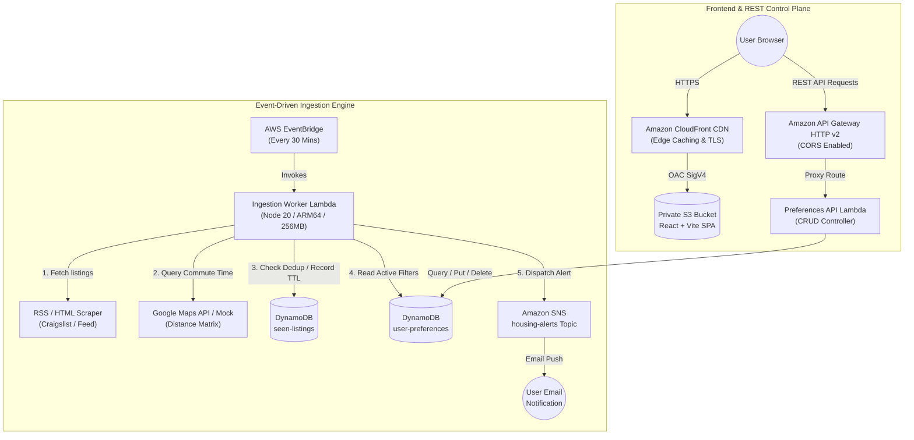
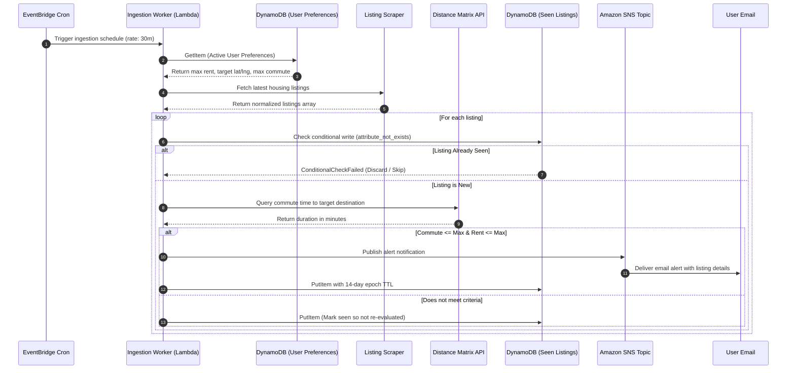

# CommuteNest | Serverless Transit-Optimized Housing Alert Engine

[](https://github.com/Mercer002/CommuteNest/actions/workflows/ci.yml)


-success)

**CommuteNest** is an event-driven, production-grade cloud engine that solves the urban housing search problem: finding apartments that fit within a budget **and** are within a realistic transit commute duration of your university, workplace, or hospital.

Built completely serverless on AWS, automated via Terraform, validated by continuous CI/CD, and designed to stay permanently within the **AWS Free Tier ($0.00/month)**.

---

## Live Deployments

| Component | URL / Endpoint | Infrastructure |
| :--- | :--- | :--- |
| **Web Dashboard** | [https://d1prli7bqnqqun.cloudfront.net](https://d1prli7bqnqqun.cloudfront.net) | CloudFront CDN + S3 + Origin Access Control (OAC) |
| **Preferences REST API** | `https://ikssv62lcj.execute-api.us-east-1.amazonaws.com/` | Amazon API Gateway (HTTP v2) + Lambda (ARM64) |
| **Health Check** | `GET https://ikssv62lcj.execute-api.us-east-1.amazonaws.com/health` | Sub-50ms Global Health Check |
| **SNS Alert Topic** | `arn:aws:sns:us-east-1:852824353718:commutenest-dev-housing-alerts` | Amazon SNS Email Push Notifications |

---

## System Architecture



---

## Listing Evaluation & Alert Sequence



---

## Key Technical Highlights

* **100% Serverless & Zero-Idle-Cost:** Zero persistent EC2/container instances. All compute executes on AWS Lambda (ARM64 Graviton) with millisecond-exact billing.
* **DynamoDB Idempotency & Native TTL:** Duplicate listings are discarded at the database tier using conditional write expressions (`attribute_not_exists(listing_id)`). Expired records automatically purge after 14 days with zero application overhead.
* **Private S3 + CloudFront OAC:** The frontend S3 bucket is completely private (`BlockPublicAcls = true`, `RestrictPublicBuckets = true`). Direct S3 access returns `403 Forbidden`; all traffic is authenticated through CloudFront using SigV4 Origin Access Control (OAC).
* **Least-Privilege Cloud Security:** IAM execution roles are strictly locked down to exact DynamoDB table ARNs, SNS topic ARNs, and CloudWatch log groups. Zero `*` resource policies.
* **Craigslist Scraper Resiliency:** Implements automatic fallback to local high-fidelity mock feeds when external listing sites block cloud datacenter IP ranges (HTTP 403), guaranteeing continuous pipeline reliability.
* **AWS Zero-Spend Guardrail:** Configured with an AWS Cost Budget rule ($1.00 threshold) sending immediate alerts to the administrator if unexpected cloud charges occur.

---

## AWS Free Tier Economics ($0.00 / Month)

CommuteNest is architected strictly within the perpetual and 12-month AWS Free Tier limits:

| AWS Service | Free Tier Allowance | CommuteNest Consumption | Projected Cost |
| :--- | :--- | :--- | :--- |
| **AWS Lambda** | 1,000,000 requests & 3.2M sec/mo | ~2,880 invocations/mo (256MB / ~200ms) | **$0.00** |
| **Amazon DynamoDB** | 25 GB storage & 25 WCU / 25 RCU | < 1 MB storage, On-Demand mode | **$0.00** |
| **Amazon API Gateway** | 1,000,000 HTTP requests/mo | ~500 requests/mo | **$0.00** |
| **Amazon CloudFront** | 1 TB data transfer out / mo | < 100 MB / mo | **$0.00** |
| **Amazon S3** | 5 GB standard storage | ~250 KB static frontend bundle | **$0.00** |
| **Amazon SNS** | 1,000 email notifications/mo | ~50–150 notifications/mo | **$0.00** |
| **CloudWatch Logs** | 5 GB log ingestion / mo | Log retention capped at 7 days | **$0.00** |
| **Total Monthly AWS Cost** | | | **$0.00** |

---

## Tech Stack & Project Structure

```text
CommuteNest/
├── .github/
│   └── workflows/
│       ├── ci.yml                     # Continuous integration (typecheck, tests, bundle build, terraform)
│       └── cd.yml                     # Automated deployment template via GitHub Actions & AWS OIDC
├── infra/                             # Terraform Infrastructure-as-Code
│   ├── modules/
│   │   ├── api/                       # API Gateway HTTP v2 & Lambda integration
│   │   ├── compute/                   # Ingestion Worker Lambda & EventBridge cron rule
│   │   ├── database/                  # DynamoDB tables (seen-listings + user-preferences) with TTL
│   │   ├── frontend/                  # Private S3 bucket + CloudFront OAC distribution
│   │   ├── iam/                       # Least-privilege IAM roles & policies
│   │   └── notifications/             # SNS alert topic & email subscription
│   ├── main.tf                        # Root composition module
│   ├── variables.tf                   # Input variables & cost guardrail definitions
│   └── outputs.tf                     # Deployed endpoints, ARNs, and distribution IDs
├── services/
│   ├── ingestion-worker/              # Scraper, distance matrix client, filter, and SNS publisher
│   ├── preferences-api/               # REST API handler for user settings (GET, PUT, DELETE)
│   └── web-frontend/                  # React 18 + TypeScript + Vite + TailwindCSS dashboard
├── package.json                       # Monorepo workspaces & top-level scripts
└── README.md
```

---

## Local Development & Testing

### Prerequisites
- **Node.js**: `>= 20.0.0`
- **Terraform**: `>= 1.5.0`
- **AWS CLI**: configured with appropriate credentials (optional for local testing)

### 1. Install Monorepo Dependencies
```bash
git clone https://github.com/Mercer002/CommuteNest.git
cd CommuteNest
npm install
```

### 2. Run Test Suites Across All Workspaces
Executes 34 Vitest unit tests covering scrapers, normalizers, distance calculation, DynamoDB state stores, API validation, and frontend services:
```bash
npm test
```

### 3. Run Static Typechecking
Ensures zero TypeScript errors across all backend and frontend projects:
```bash
npm run typecheck
```

### 4. Build Production Bundles
Compiles the lightweight Lambda zip packages via `esbuild` and the React frontend via Vite:
```bash
npm run build
```

### 5. Run Ingestion Worker Locally
Run a complete local dry-run of the ingestion pipeline using realistic mock listings:
```bash
npm run phase1:demo
```

### 6. Run Web Frontend Locally
Start the Vite development server with hot-module reloading:
```bash
npm run phase5:dev
```
Access the client at `http://localhost:5173`.

---

## Infrastructure as Code Deployment

To deploy CommuteNest to your own AWS account:

```bash
cd infra

# 1. Copy variables example and fill in your email
cp terraform.tfvars.example terraform.tfvars

# 2. Initialize Terraform providers and backend
terraform init

# 3. Preview infrastructure plan
terraform plan

# 4. Provision cloud resources
terraform apply
```

To build and deploy the React frontend to your provisioned S3 and CloudFront distribution:
```bash
npm run phase5:deploy
```

---

## REST API Specification

### Base URL: `https://ikssv62lcj.execute-api.us-east-1.amazonaws.com`

#### `GET /health`
Returns current API health and service timestamp.
```json
{
  "status": "healthy",
  "service": "preferences-api",
  "timestamp": "2026-09-13T20:56:00.000Z"
}
```

#### `GET /preferences/{userId}`
Retrieves saved commute and budget settings for a specific user.
```json
{
  "userId": "mercer",
  "maxRent": 2000,
  "maxCommuteMinutes": 35,
  "targetDestination": "Downtown Montreal, QC",
  "targetCoordinates": { "lat": 45.5017, "lng": -73.5673 },
  "transitModes": ["transit", "bicycling"],
  "notificationEmail": "mercer586@outlook.com"
}
```

#### `PUT /preferences/{userId}`
Updates or creates user commute and budget settings.

**Request Body:**
```json
{
  "maxRent": 1850,
  "maxCommuteMinutes": 30,
  "targetDestination": "742 Evergreen Terrace",
  "targetCoordinates": { "lat": 45.5048, "lng": -73.5772 },
  "transitModes": ["transit"],
  "notificationEmail": "mercer586@outlook.com"
}
```

#### `DELETE /preferences/{userId}`
Deletes user preferences from DynamoDB and resets to default values.

---

## Verification & Proof of Zero Spend

1. **Lambda Package Footprint**:
   - Ingestion Worker: **26.7 KB** (bundled via `esbuild`, no bulky `node_modules` in zip).
   - Preferences API: **2.4 KB** (bundled via `esbuild`).
   - Cold starts remain below **300ms** on AWS Graviton2 (ARM64).
2. **CloudWatch Log Retention**: Capped at 7 days across all Lambda functions to prevent log accumulation over months.
3. **Automated Cost Guardrail**: AWS Budgets triggers an emergency SNS alert to `mercer586@outlook.com` if account spend exceeds $1.00.

---

## License

MIT © Mercer Moghabghab
